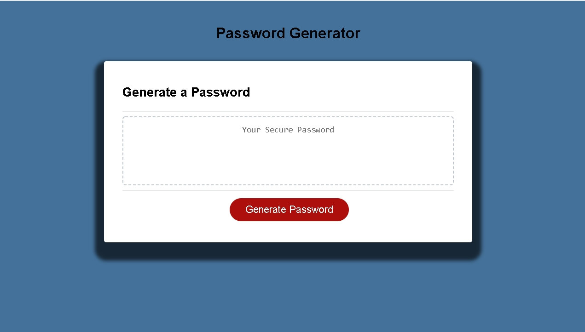
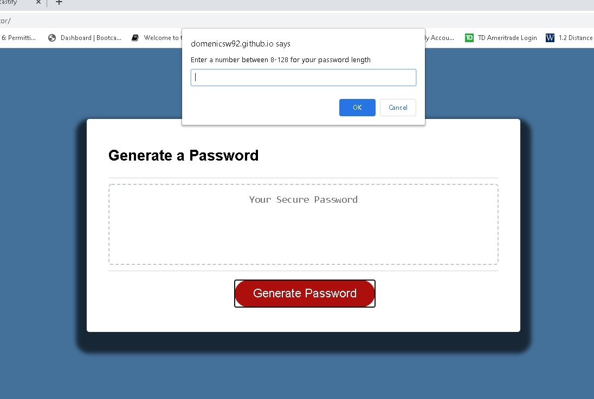
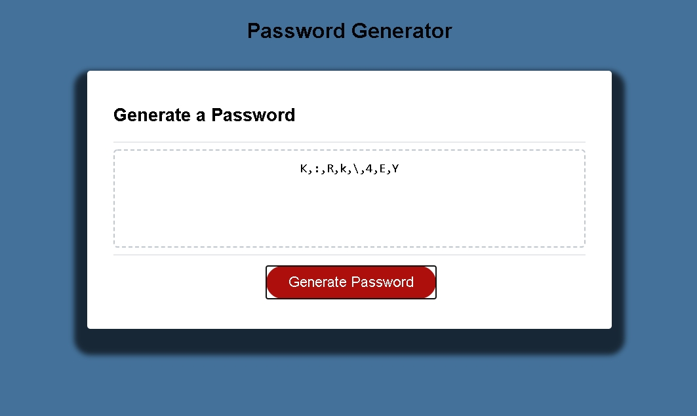

# Password-Generator
This project was done in order to create a site that generates passwords for the user with the characters in which they might want including  Uppercase, lowercase, numbers and special characters for the password.
The project mainly consists of JavaScript needed to be added to an existing file,  as  I was provided with the resources of an already assembled HTML file and all CSS.

The project has been deployed on GitHub Pages  and is up and running follow the deployment  link
https://domenicsw92.github.io/Password-Generator/

 This quick video will display how the deployed site works

The site deploys with a clean look CSS was added to the background of the site and added box-shadowing from the original format.

Once the generate password button is clicked the site will that the user into a verity of prompts.
This is were the user will select their personal options for their password
    - Enter a number between 8-128 for your password length
    - Would you like Uppercase Characters
    - Would you like Lowercase Characters
    - Would you like Numbers
    - Would you like Special Characters

If no options are selected for the password the prompts will revert back giving you an error message

If at least one or more options are selected the password will generate 

